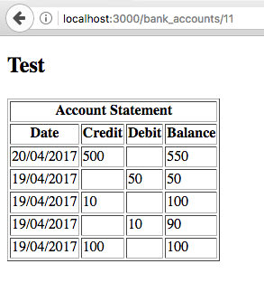

# README

This is a Bank tech test practise, where you can create bank accounts, withdraw or deposit money into them and see your account statements.

Please find more details about the specifications at https://github.com/makersacademy/course/blob/master/individual_challenges/bank_tech_test.md

* Ruby version: 2.4.0

* System dependencies: Rails version: 4.2.8

* Run 'bundle install' to get all dependencies from Gemfile

* Used PostgreSQL database (run 'rake db:migrate' to initialize database)

* Run 'rspec' to run the test suite

* Deployment to Heroku by running 'heroku create <your_chosen_app_name>'
